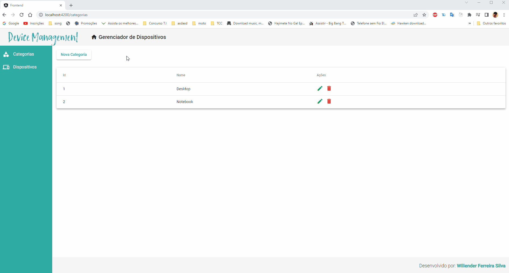

<h1 align="center">Desafio FullStack!⚡</h1>

  Desafio FullStack, Front-End Angular, Back-End NodeJS.

  
  
  

##

  

##
 

  
  <h2> Descrição do projeto </h2>
  O projeto tem como finalidade, o desenvolvimento tem como objetivo a criação de um simples Device Management (Gerenciador de Dispositivos) web app, para fins didaticos
    
  Validando também, a minha capacidade como desenvolvedor FullStack.
  

##

  
  <h2> Tecnologias utilizadas </h2>
  📌- NodeJS   
  📌- Angular   
  📌- Typescript   
  📌- Angular Material   
  📌- KnexJS   
  📌- Mysql   
  📌- Express   
  

##

  
  <h2> Rodando a aplicação </h2>
  
  Se faz necessário a instalação do Node para o fluxo do projeto, podendo ser executado em uma IDE ou prompt de sua escolha.

   ✔ - Clone o projeto a partir deste repositório com o "git clone (link do projeto)"   
   ✔ - Caminhe até a pasta clonada, frontend e backend.   
   ✔ - Instale as dependências do projeto utilizando o comando "npm install . " ou "npm i".   
   ✔ - Faça a conexão com um servidor, exporte as migrations com o comando "knex migrate:latest".  
   ✔ - Após a instalação, inicie o projeto utilizando o comando "npm start" no backend e no frontend.  
   ✔ - Frontend http://localhost:4200/
   ✔ - Backend http://localhost:3000/
   ✔ - Projeto iniciado com sucesso.   

  

##

  
  <h5>Wiliender Ferreira Silva</h5>
  

